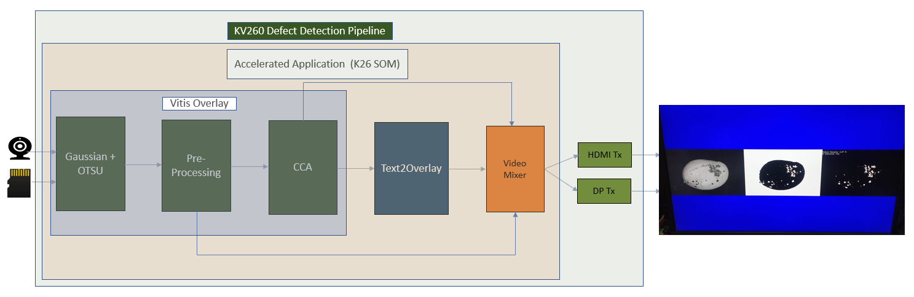

<h1 align="center">DEFECT DETECT APPLICATION </h1>

## Introduction
This repository contains source code of Kria SOM Defect Detect accelerated application. 

The Defect Detection accelerated application is a machine vision application that automates detection of defects in mangoes and sorting in high-speed factory pipelines by using computer vision library functions.

 <div align="center">
  
</div>

For more details refer [Defect Detect Landing Page](https://xilinx.github.io/kria-apps-docs/kv260/2022.1/build/html/docs/defect-detect/defectdetect_landing.html#)

## How to Cross Compile

If you want to cross compile the source in Linux PC machine, follow these steps, otherwise skip this section.

1. Refer to the [K260 SOM Starter Kit Tutorial](https://xilinx.github.io/kria-apps-docs/kv260/2021.1/build/html/docs/build_petalinux.html#build-the-sdk) to build the cross-compilation SDK, and install it to the path you choose or default. Suppose it's SDKPATH.

2. Run "./build.sh ${SDKPATH}" in the source code folder of current application, to build the application. <a name="build-app"></a>

3. The build process in [2](#build-app) will produce a rpm package DefectDetect-2.0.2-1.aarch64.rpm under build/, upload to the board, and run "rpm -ivh --force ./DefectDetect-2.0.2-1.aarch64.rpm" to install updates.


## Setting up the Board and Application Deployment
A step by step tutorial and details on how to setup the board and run this application is given in the [Defect Detect Documentation](https://xilinx.github.io/kria-apps-docs/kv260/2022.1/build/html/docs/defect-detect/docs/app_deployment_dd.html). Please visit the documentation page for more details.


# Files structure

* The application is installed as:

    * Binary File Directory: /opt/xilinx/kv260-defect-detect/bin

        | Filename        | Description |
        |-----------------|-------------|
        | defect-detect   | main app    |

    * Script File Directory: /opt/xilinx/kv260-defect-detect/bin

      | Filename                        | Description                                                     |
      |---------------------------------|-----------------------------------------------------------------|
      | `defect-detect-install.py`      | Script to copy Jupyter notebook to user directory.              |
      | `ar0144-sensor-calib.sh`        | Script to do the sensor calibration for user test environment.  |

    * Configuration file directory: /opt/xilinx/kv260-defect-detect/share/vvas/

        | Filename                    | Description                               |
        |-----------------------------|-------------------------------------------|
        | cca-accelarator.json        | Config of CCA accelarator.                |
        | otsu-accelarator.json       | Config of OTSU accelarator.               |
        | preprocess-accelarator.json | Config of pre-process accelarator.        |
        | text2overlay.json           | Config of text2overlay.                   |

     * Jupyter Notebook Directory:  /opt/xilinx/kv260-defect-detect/share/notebooks/

       | Filename             | Description                              |
       |----------------------|------------------------------------------|
       | defect-detect.ipynb  | Jupyter notebook file for defect detect  |


## License

````
Copyright 2022 Xilinx Inc.
Licensed under the Apache License, Version 2.0 (the "License");
you may not use this file except in compliance with the License.
You may obtain a copy of the License at

    http://www.apache.org/licenses/LICENSE-2.0

Unless required by applicable law or agreed to in writing, software
distributed under the License is distributed on an "AS IS" BASIS,
WITHOUT WARRANTIES OR CONDITIONS OF ANY KIND, either express or implied.
See the License for the specific language governing permissions and
limitations under the License.
````

<p align="center"><sup>Copyright&copy; 2021-2022 Xilinx</sup></p>